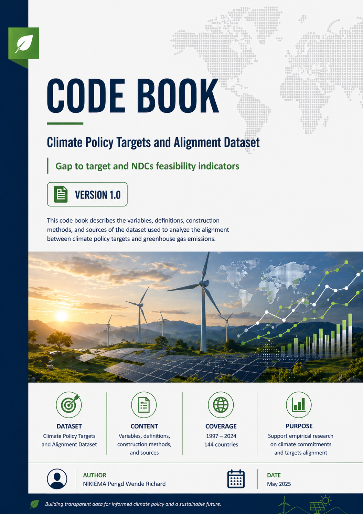
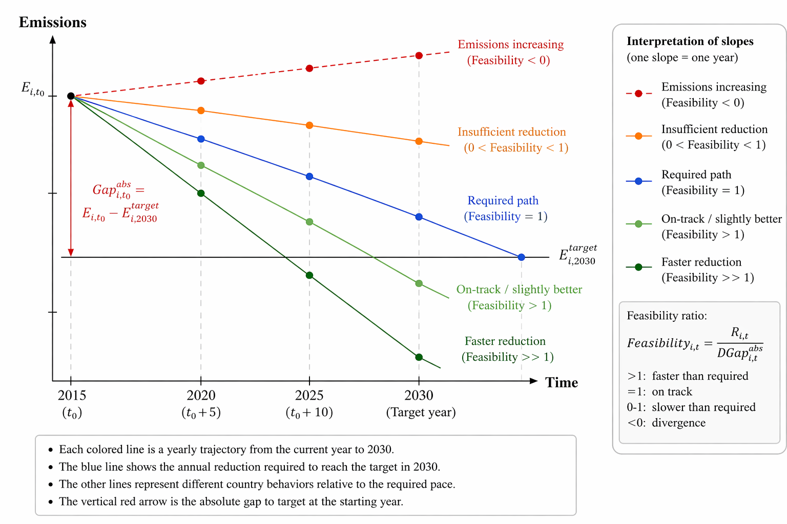

<p align="center">
  
</p>

# Climate Policy Targets and Alignment Dataset

This repository provides a harmonized framework for measuring countries’ climate performance relative to their international climate commitments under the Kyoto Protocol and successive Nationally Determined Contribution (NDC) cycles.

The project develops and operationalizes a novel **Gap-to-Target indicator** designed to measure the distance between observed greenhouse gas emissions and the emissions levels implied by national climate commitments.

The repository combines:
- harmonized NDC target extraction,
- historical emissions data,
- BAU scenario projections,
- feasibility indicators,
- and cross-country climate policy analytics.

Coverage:
- **144 countries**
- **1997–2024**
- Kyoto Protocol, First NDCs, and Second NDCs

---

# Methodological Framework

<p align="center">
  
</p>

## Intuition of the Gap-to-Target and Feasibility Indicators

This figure illustrates the conceptual framework underlying the **Gap-to-Target** and **Feasibility** indicators developed in this project.

- The vertical red arrow represents the **absolute gap to target**, defined as the difference between observed emissions and the target-consistent emissions level.
- The blue trajectory represents the **required annual reduction path** needed to reach the emissions target by the target year.
- Alternative colored trajectories illustrate different country adjustment dynamics relative to the required pace.

The feasibility indicator compares the observed annual emissions reduction with the annual reduction required to close the remaining gap before the target deadline.

### Interpretation of the Feasibility Ratio

| Feasibility value | Interpretation |
|---|---|
| > 1 | Emissions are declining faster than required |
| = 1 | Country is exactly on the required trajectory |
| 0 < x < 1 | Reduction is insufficient to meet the target on time |
| < 0 | Emissions are increasing (divergence from target) |

This framework provides a transparent and operational way to evaluate whether countries are effectively aligning their realized emissions trajectories with their climate commitments under the Kyoto Protocol and successive NDC cycles.

---

# Data Availability Notice

## Restricted Data Access Pending Peer Review

The complete harmonized dataset is currently not publicly released.

At this stage, only the methodological framework, analytical pipeline, and source code are made publicly available in order to ensure transparency, reproducibility, and methodological scrutiny.

The public release of the full dataset is temporarily restricted for publication-related reasons while the associated research work undergoes peer review and academic evaluation.

This precaution is intended to:
- preserve the integrity of the scientific publication process,
- avoid premature circulation of unpublished research outputs,
- and ensure consistency between the final published article and the disseminated dataset.

The repository nevertheless provides:
- the complete methodological framework,
- the data construction logic,
- the harmonization procedures,
- the analytical scripts,
- and the visualization pipeline used to construct the indicators.

The full harmonized database, documentation, and supplementary materials are expected to be released following the completion of the peer-review and publication process.

For academic collaborations, replication requests, or research inquiries, please contact:

**NIKIEMA Pengd Wende Richard**  
Université Clermont Auvergne  
Climate Finance Researcher  
📧 P-Wende_Richard.NIKIEMA@doctorant.uca.fr

---

# Project Structure

```text
├── climate_watch_ndc.py
├── Gap_to_target_Builder.py
├── Gap_to_target_Analyser.py
├── Robustness_Analyser.py
├── README.md
```

---

# Files Description

## `climate_watch_ndc.py`

Main data extraction and preprocessing pipeline for Nationally Determined Contributions (NDCs) from the Climate Watch API.

### Main functionalities

- Automated API requests with retry management
- Cleaning and normalization of NDC textual data
- Extraction of mitigation targets
- Parsing of target years, conditionality, and target formats
- Identification of:
  - unconditional targets
  - conditional targets
  - intensity targets
  - BAU targets
  - peaking targets
- Construction of structured NDC datasets
- Export to Excel-compatible formats

This script constitutes the core ETL pipeline of the project.

---

## `Gap_to_target_Builder.py`

Construction of the harmonized climate policy panel dataset.

### Main functionalities

- Cleaning and standardization of:
  - NDC datasets
  - EDGAR emissions data
  - OWID climate data
  - NGFS scenario projections
- ISO3 harmonization
- Construction of:
  - Kyoto targets
  - NDC targets
  - emissions trajectories
  - dynamic gap indicators
  - feasibility indicators
- Panel dataset generation (1997–2024)
- Export to Stata `.dta` format

### Integrated data sources

- Climate Watch
- EDGAR
- Our World in Data
- NGFS scenarios

---

## `Gap_to_target_Analyser.py`

Main empirical analysis and visualization script.

### Main functionalities

- Computation of:
  - absolute gap-to-target indicators
  - relative gap-to-target indicators
  - dynamic feasibility indicators
- Global dynamic analysis of climate commitment alignment
- Income-group comparisons
- Regional comparisons
- Distribution analysis
- Top/bottom country performance analysis
- Automated graph generation

### Outputs

- figures
- comparative charts
- histograms
- regional visualizations
- income-group visualizations
- robustness plots

---

## `Robustness_Analyser.py`

Robustness and supplementary empirical analysis script.

### Main functionalities

- Robustness checks
- Alternative BAU specifications
- Alternative accounting frameworks
- Sensitivity analysis
- Appendix figures
- Additional comparative visualizations
- Extended descriptive statistics

### Used for

- supplementary materials
- appendices
- validation exercises

---

# Dataset Content

The harmonized panel dataset includes:

- Kyoto Protocol targets
- First NDC targets
- Second NDC targets
- Main harmonized target indicators
- Conditional and unconditional targets
- EDGAR emissions
- Consumption-based emissions
- NGFS BAU projections
- Gap-to-target indicators
- Dynamic gap indicators
- Feasibility indicators
- Regional classifications
- Income-group classifications

---

# Research Scope

This repository supports empirical research on:

- Climate policy
- Nationally Determined Contributions (NDCs)
- Emissions gap analysis
- Climate finance
- International environmental agreements
- Kyoto Protocol and Paris Agreement alignment
- Climate target feasibility
- Climate governance
- Global Stocktake monitoring
- Climate policy implementation

---

# Main Technologies

- Python
- Pandas
- NumPy
- Matplotlib
- GeoPandas
- Requests
- OpenPyXL

---

# Outputs

The project generates:

- Harmonized climate datasets
- Emissions gap indicators
- Comparative visualizations
- Feasibility metrics
- Policy analysis figures
- Stata panel databases
- Appendix materials
- Robustness analysis outputs

Coverage:
- **144 countries**
- **1997–2024**

---

# Codebook

The complete methodological documentation and variable dictionary are available in the project codebook.

---

# Citation

If you use this repository, dataset, or methodology, please cite:

> NIKIEMA, Pengd Wende Richard (2026).  
> *Climate Policy Targets and Alignment Dataset: Gap-to-Target and NDC Feasibility Indicators (Version 1.0).*  
> Université Clermont Auvergne.

---

# Copyright

© 2026 NIKIEMA Pengd Wende Richard — All rights reserved.

No part of this repository, dataset, documentation, analytical framework, or associated materials may be reproduced, distributed, modified, or used for commercial purposes without prior written permission from the author.